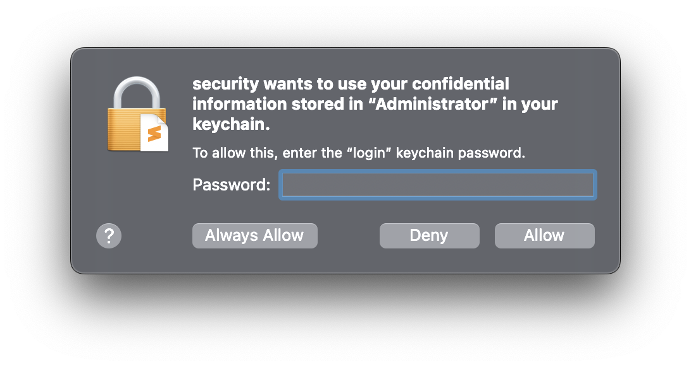
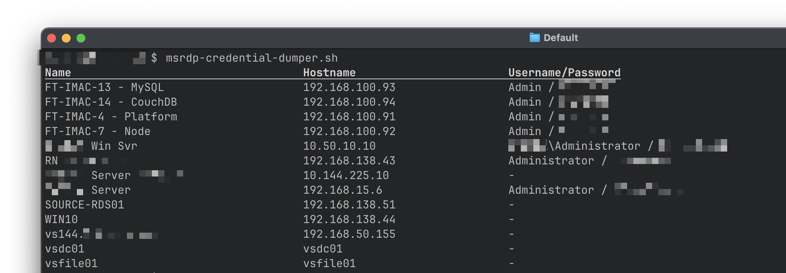

## MS RDP Credential Dumper

This is a small program for macOS that retrieves and dumps out [Microsoft Remote Desktop][2] (rebranded as "Windows App" in Sep 2024) connections and their associated credentials, including the passwords (if they are saved in the Keychain).

The first time you run it, you may be prompted to enter your password so the `security` tool can access the Keychain item. If you choose **Always Allow** then you won't be prompted on subsequent runs. _Do this only if you are confident of the security of the computer you're running the script on._



## Instructions

1. Clone this repo (click the green **Code** button above, then click **Download ZIP**).
2. Unzip that file and copy `msrdp-credential-dumper.sh` to your `$PATH` somewhere. I suggest `/usr/local/bin` if you're unsure.
3. Make sure the script is executable by issuing this command from a Terminal:
   ```shell
   chmod u+x /usr/local/bin/msrdp-credential-dumper.sh
   ```
4. Run the script from a Terminal (see below)

## Sample output



## Related AskDifferent posts

- [Microsoft Remote Desktop Keychain access][1]
- [Where does Microsoft RDP for Mac store its configuration][3]

[1]: https://apple.stackexchange.com/questions/380121/microsoft-remote-desktop-keychain-access
[2]: https://apps.apple.com/us/app/microsoft-remote-desktop/id1295203466
[3]: https://apple.stackexchange.com/questions/182209/where-does-microsoft-rdp-8-for-mac-store-its-configuration